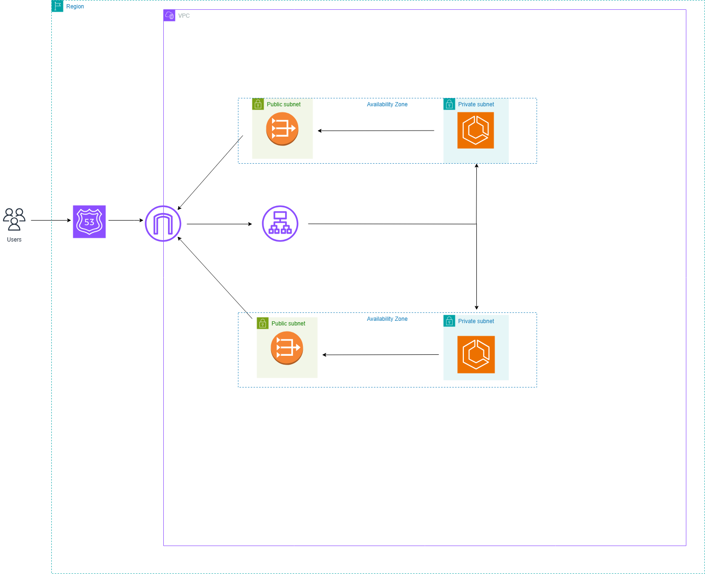

<h1>End-to-End AWS ECS Project</h1>

<h2> Overview </h2>

This AWS ECS end-to-end project involves deploying a node.js goals-management application, which allows users to create and manage their own goals, to AWS ECS. The technologies I used were Terraform, Docker, AWS, GitHub Actions, and Node.js. Terraform modules were used to create code that was both reusable and adhered to standard practices. 

AWS services such as ECS, ECR, VPC, Route53, CloudWatch, and ACM were utilised for this project. Best practices were followed and implemented within the project. Git pre-commit hooks were also used to ensure Terraform code was scanned and adhered to best practices before being committed and pushed to GitHub.

This README outlines step-by-step instructions for setting up and running your Docker containers locally, pushing your Docker images to AWS ECR, and setting up our AWS infrastructure to deploy our containerised application.

<h2> Prerequisites </h2>

To follow this project you will need the following installed:

🛠 Prerequisites
Before starting on this project, be sure to have the following installed on your computer:

- ✅ An AWS Account - [Create An Account Here](https://aws.amazon.com/free/?trk=ce1f55b8-6da8-4aa2-af36-3f11e9a449ae&sc_channel=ps&ef_id=Cj0KCQjw782_BhDjARIsABTv_JCWZitQyH0tU_lYElDDQ9HdBabDxB-tKSgYDsRiU0N_XqiVVpjvBTUaAmR7EALw_wcB:G:s&s_kwcid=AL!4422!3!433803621002!e!!g!!aws%20sign%20up!9762827897!98496538743&gclid=Cj0KCQjw782_BhDjARIsABTv_JCWZitQyH0tU_lYElDDQ9HdBabDxB-tKSgYDsRiU0N_XqiVVpjvBTUaAmR7EALw_wcB&all-free-tier.sort-by=item.additionalFields.SortRank&all-free-tier.sort-order=asc&awsf.Free%20Tier%20Types=*all&awsf.Free%20Tier%20Categories=*all)

- ✅ Terraform - [Download & Install](https://developer.hashicorp.com/terraform/tutorials/aws-get-started/install-cli)

- ✅ Docker - [Download & Installl](https://www.docker.com/get-started/)

For this specific project you can use whatever application you want. Ensure the application works on your local machine before containerising it. Also, be wary of what application port your application is listening to, and that you are mapping the correct host network port to the container.

<h2> Architectural diagram of the project </h2>

Below is a visual architectural representation of the infrastructure that we are going to be setting up in this project:



<h2> Step 1: Running the node.js application on a container locally </h2>
We are going to be testing the application on a container running on our local machine before having it run on AWS ECS. To do this you will need to build the Docker image by creating a Dockerfile that will handle the application dependencies and setup needed for the app to work within the container:

```hcl
FROM node:22-alpine as Build

WORKDIR /app

COPY package.json .

COPY . .

RUN npm install

FROM node:22-alpine

WORKDIR /app

COPY --from=Build /app /app

EXPOSE 80

CMD ["node", "server.js"]
```

This Dockerfile takes advantage of multi-stage builds to help optimise and speed up Docker image build times. This helps reduce the size of the image.

To create the image run the following command:

```hcl
docker build -t goals-image:latest .
```

To start up the container using the Docker image you just built, run the following command:

```hcl
docker run -d -p 80:80 --name goals-container goals-image
```

Run `docker ps` to ensure the container is running.

To access your container that you just started up you will have to connect to it through localhost - for example in this case: http://locahost:80

If you can access your application, you have successfully connected to your container via your localhost. If you are having connections make sure you have probably set up everything and that you have exposed the right ports for your container.


<h2> Step 2: Setting up AWS ECR Image Repository </h2>

After git cloning the repository, cd into the ECR module and run ``` terraform init ``` to initialise your current working directory, and to also install the provider plugins.

After that run the ``` terraform plan ``` command to see what is going to be created and deployed, and then the ``` terraform apply ``` command to deploy the AWS ECR image repo:

You should see a newly created AWS ECR image repo inside of AWS ECR:


<h2> Step 3: Pushing Docker image to ECR </h2>

After getting the container running on your local machine, it is time to deploy this container to AWS ECS. Before we can do that though we need to push a Docker image to AWS ECR so that our containerised app running within AWS ECS can pull our image from AWS ECR.

Run the following command to generate an authentication token that you need to authenticate with AWS ECR to push your Docker images to it:

```hcl
aws ecr get-login-password --region <region_name>
```

Run the following command to authenticate with AWS ECR:

```hcl
aws ecr --region <region> | docker login -u AWS -p <authentication_token> <repo_uri>
```

Now tag your docker image with the ECR Registry:

```hcl
docker tag <source_image_tag> <target_ecr_repo_uri>
```

Now push your docker image to AWS ECR:

```hcl
docker push <ecr-repo-uri>
```

You should now be able to see your Docker image within your AWS ECR repo:


<h2> Step 4: Setting up the application to run on AWS ECS </h2>

Now that we have our container image in AWS ECR, it is time to run our application within AWS ECS.

In the cloned repo you will see a directory called modules  that contains Terraform modules such as an ECS module, ALB module, CloudWatch module, Route 53 module, and a VPC module. To deploy the infrastructure run the ``` terraform init ``` command to initialise your current working directory, install the provider plugins, and install the modules that we have instantiated within the main.tf file. After doing this, run the ```terraform plan``` command to see the plan execution and then run ```terraform apply``` to deploy the infrastructure:


<h2> Step 5: Accessing the web application </h2>

Wait for your ECS tasks to be running, and you should be able to access the application by typing in ikarmaaa123.com (or the domain name you have created). You should be directed to the webpage:


<h2> Step 6: Cleaning up </h2>

Well done, you now have successfully deployed your containerised application to AWS ECS and can access it through your own created domain name over an encrypted connection. Now it is important to delete your resources so that you do not incur any costs. In your current working directory that you are in run the ``` terraform destroy -auto-approve ``` command to destroy your resources:


Now cd out of main and cd into modules/ECR to destroy the AWS ECR repository through the ```terraform destroy``` command:


<h2> Step 7: Building Docker image, pushing Docker image, creating and destroying the infrastructure through GitHub Actions CI/CD pipelines </h2>

Now that you have manually built your Docker image, pushed it to ECR, created the infrastructure, and destroyed it manually, it is time to automate this whole process through CI/CD pipelines. After you clone the repository, you will find two GitHub Actions CI/CD pipeline YAML configuration files - ```deploy.yml``` and ```destroy.yml```. The deploy pipeline does several things- automating the creation of the Docker image, pushing the Docker image to AWS ECR, and setting up our AWS infrastructure. The destroy pipeline destroys the whole infrastructure. After pushing to your GitHub, to run these pipelines navigate over to actions at the top:


After you have clicked 'actions', on the left you will see the workflows that you pushed from your local repository to your remote repository:


Click on the 'Building Docker Image, Pushing Docker Image to ECR, and Creating AWS Resources' pipeline and then press 'run workflow':


You should see your workflow running:


Click on it to see the 'jobs' that are currently running within your pipeline:


If all the jobs have a tick then you have successfully automated the deployment process for this whole project:


Type in 'ikarmaa123.com' in your browser and you should be prompted with the same goals web page that we deployed before manually:


Now destroy the infrastructure by running the 'Destroying Terraform Resources' workflow:


# Amazon Elastic Compute Cloud (EC2)

## Amazon EC2 Overview

- EC2 instances are **virtual servers** running in the AWS data centers
- EC2 instances can run Windows or Linux + MacOS option on dedicated hardware
- EC2 instances are attached to the network via an Elastic Network Interface (ENI)
- EC2 instances are launched in **public** or **private** subnets within an Amazon Virtual Private Cloud (VPC)
- Amazon EC2 runs on servers in **AWS data centers**
    - Many instances run on each host servers
- An EC2 instance is a virtual server and is managed by the **customer**.
- A selection of **instance types** come with varying combinations of CPU, memory, storage and networking.

### Flexible and On-Demand

- Instances can be **stopped** when not needed - you only for it when it is running.
- Instances can then be **started up** again.
- You can **terminate** an instance if you no longer need it
- You get charged for the EBS volume capacity that you go with. It does not matter whether you have used up any of the capacity up or not, you still get charged for it.

### EC2 Instances Families & Types

- Instance **families** provide varying combinations of hardware resources.
- These are optimised for different compute workloads:
    - General Purpose
    - Compute Optimised
    - Memory Optimised
    - Accelerated Computing
    - Storage Optimised
- Larger sizes provide greater hardware capability
- **m**5.large - **m** is the family name - this also means it is a memory optimised instance type
- **5** is the generation number
- **large** is the size of the instance


### Elastic Network Interfaces (ENIs)


### Public, Private, and Elastic IP addresses


### Network Interfaces (ENI, ENA, EFA)

- **Elastic network interface**
    - Basic adapter type for when you don’t have any high-performance requirements.
    - Can use with all instance types
- **Elastic network adapter**
    - Enhanced networking performance
    - Higher bandwidth and lower inter-instance latency
    - Must choose supported instance type
- **Elastic Fabric Adapter**
    - Use with High Performance Computing and MPI and ML use cases
    - Tightly coupled applications
    - Can use with all instance types

### Amazon Elastic Block Store


### Amazon EBS Volume Types


### Amazon EBS Volume Use Cases

- **gp3 (General Purpose SSD)** - Most workloads, including databases and dev/test environments
- **gp2 (General Purpose SSD)** - Boot volumes, dev/test, general workloads
- **Io2 (Provisioned IOPS SSD)** - High-performance database, critical applications
- **Io1 (Provisioned IOPS SSD)** - Databases requiring high IOPS
- **st1 (Throughput Optimised HDD)** Streaming, big data, log processing
- **sc1 (Cold HDD)** - Archival storage, infrequent access workloads
- **Magnetic (standard)** - Legacy workloads, small boot volumes

### Amazon EBS vs Instance Store


## Launching an EC2 Instance


## Amazon EC2 User Data and Metadata

### Amazon EC2 Metadata

- Instance metadata is data about your EC2 instance
- Instance metadata is available at: [**http://169.254.169.254/latest/meta-data**](http://169.254.169.254/latest/meta-data)
- Examples:
    
    
    
- Examples ctd:


### IMDSv1 vs IMDSv2

Instance Metadata Service (IMDS) comes in two versions:

- **IMDSv1** - is older and less secure
- **IMDSv2** - is newer, more secure, and requires a session token for authorization
- Default EC2 launch settings may **disable IMDSv1**


## Amazon EC2 User Data

- The code is run when the instance starts for the **first time**
- **Batch** and **PowerShell** scripts can be run on Windows
- User data must be **base64-encoded**
- Encoding is automatic with the console and AWS CLI
- User data is limited to **16KB**, in raw form, before it is base64-encoded
- User data only runs the **first time** you launch your instance
    
    
    

### Amazon EC2 User Data via the AWS CLI


## Using Access Keys with Amazon EC2

- Not as secure as the access keys are **directly stored** on the EC2 instance, and not to mention the access keys for an IAM user are **long-term credentials** which is not ideal.


- EC2 assumes the IAM role. It utilises **sts (security token service)** to gain **temporary credentials** **or access keys** that have a **short expiry date**.
- Just before they expire, the EC2 instance **renegotiates** for a new set of short-term credentials.


## EC2  Placement Groups

- **Cluster** - packs instances close together inside an Availability Zone. This strategy enables workloads to achieve the **low-latency** network performance necessary for **tightly-coupled** node-to-node communication that is typical of **HPC applications**.
- **Partition** - spreads your instances across logical partitions such that groups of instances in one partition **do not share the underlying hardware** with groups of instances in different partitions. This strategy is typically used by large **distributed and replicated workloads**, such as Hadoop, Cassandra, and Kafka.
- **Spread** - strictly places a small group of instances across **distinct underlying hardware** to reduce correlated failures.

### Cluster Placement Group


### Partition Placement Group


### Spread Placement Group


### EC2 Placement Group Use Cases

- Example for Cluster - Tightly-coupled application that requires low-latency, high throughput network traffic between instances.
- Example for Partition - Distributed and replicated NoSQL database; requires separate hardware for node groups.
- Example for Spread - Small number of critical instances that should be kept separate from each other.

## Network Interfaces (ENI, ENA, EFA)


## NAT for Public Addresses


## Private Subnets and Bastion Hosts

- **Bastion host** is a **jump host**. Allows you to connect to a private instance in a private subnet through the public subnet. This is due to network traffic being routed through the **VPC router** as both the public and private instances have private ip addresses that are within the VPC cidr range.


## NAT Gateways and NAT Instances Overview

- Enables instances in private subnets to be able to communicate to the traffic through outbound connections.
- Traffic is not **bi-directional** (meaning someone can’t just connect to our instance through inbound connections).
- The **NAT gateway** is created in the **public subnet**
- **NAT Gateway**
    
    
    
- **NAT Instances**
    
    
    

### Nat Instance vs NAT Gateway


## EC2 Instance Lifecycle


- **Stopping EC2 instances**
    - EBS backed instances only
    - No charge for stopped instances
    - EBS volumes remain attached (chargeable)
    - Data in RAM is lost
    - Instances is migrated to a different host when you start it back up again.
    - Private IPv4 addresses and IPv6 addresses retained; public IPv4 addresses are released.
    - Associated Elastic IPs retained
- **Hibernating EC2 instances**
    - Applies to supported AMIs
    - Contents of RAM saved to EBS volume
    - Must be enabled for hibernation when launched
    - Specific prerequisites apply
    - When started (after hibernation)
        - The EBS root volume is restored to is previous state
        - The RAM contents are reloaded
        - The processes that were previously running on the instance are resumed
        - Previously attached data volumes are reattached and the instance retains its instance ID
- **Rebooting EC2 instances**
    - Equivalent to an OS reboot
    - DNS name and all IPv4 and IPv6 addresses retained
    - Does not affect billing
- **Retiring EC2 instances**
    - Instances may be retired if AWS detects irreparable failure of the underlying hardware that hosts the instance.
    - When an instance reaches its scheduled retirement date, it is stopped or terminated by AWS
- **Terminating EC2 instances**
    - Means deleting the EC2 instance
    - Cannot recover a terminated instance
    - By default, root EBS volumes are deleted
- **Recovering EC2 instances**
    - CloudWatch can be used to monitor system status checks and recover instance if needed
    - Applies if the instance becomes impaired due to underlying hardware / platform issues
    - Recovered instance is identical to original instance

## Nitro Instances and Nitro Enclaves

- Nitro is the **underlying platform** for the **next generation** of EC2 instances
- Support for may **virtualised** and **bare metal** (Instance types that are connected directly into that physical infrastructure layer) instance types.
- Breaks functions into specialised hardware with a Nitro Hypervisor
- Specialised hardware includes:
    - Nitro cards for VPC
    - Nitro cards for EBS
    - Nitro for Instance Storage
    - Nitro card controller
    - Nitro security chip
    - Nitro hypervisor
    - Nitro Enclaves
- Improves performance, security and innovation:
    - Performance close to bare meta for virtualised instances
    - Elastic Network Adapter and Elastic Fabric Adapter
    - More bare metal instance types
    - Higher network performance (e.g. 100 Gbps)
    - High Performance Computing (HPC) optimisations
    - Dense storage instances (e.g. 60 TB)
- AWS Nitro Enclaves
    - Isolated compute environments
    - Runs on isolated and hardened virtual machines
    - No persistent storage, interactive access, or external networking
    - Uses cryptographic attestation to ensure only authorized code is running
    - Integrates with AWS Key Management Service (KMS)
    - Protect and securely process highly sensitive data:
        - Personally identifiable information (PII)
        - Healthcare data
        - Financial data
        - Intellectual Property data


